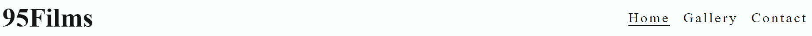
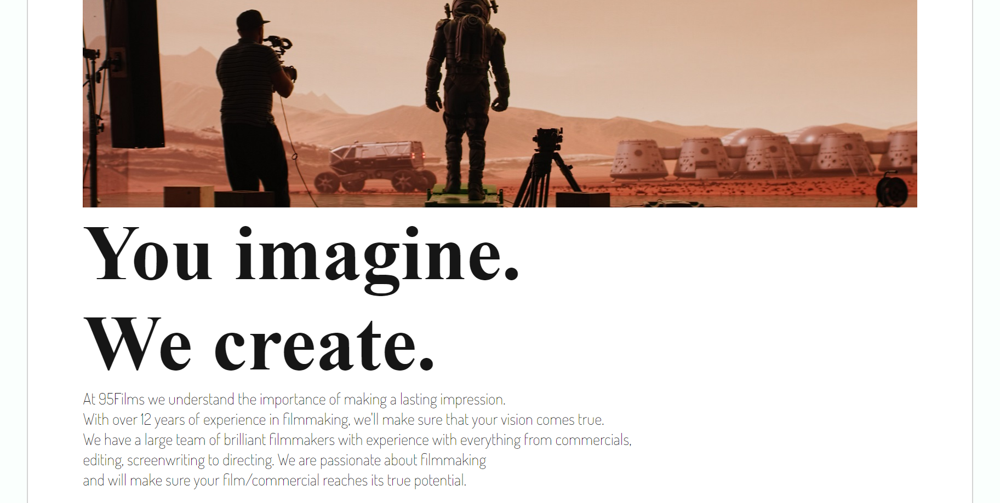
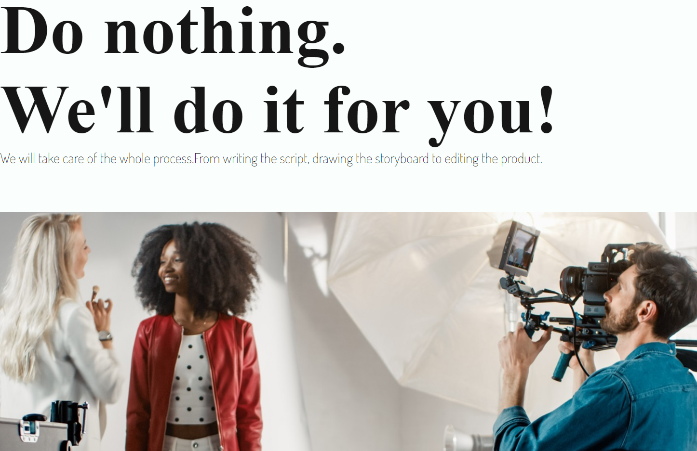
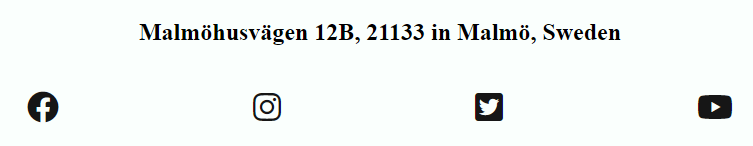
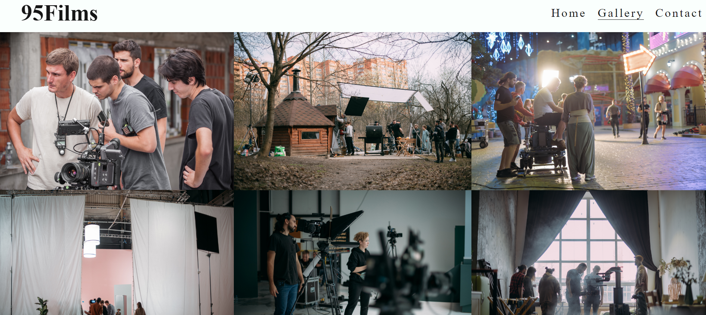
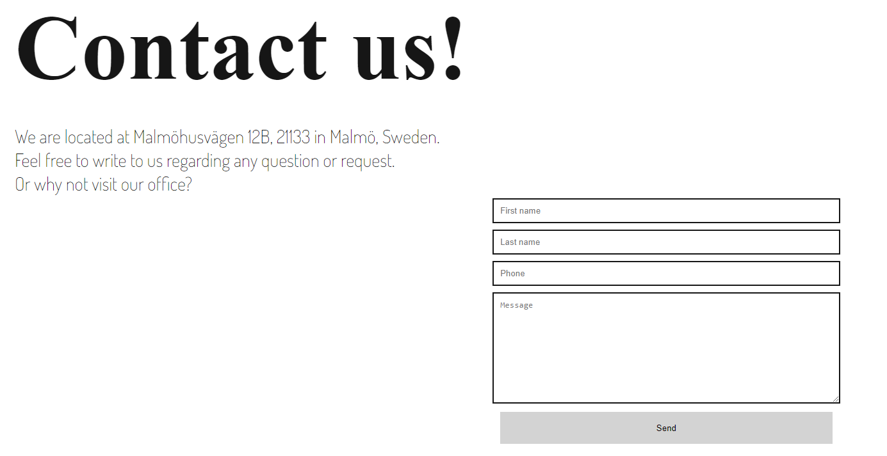
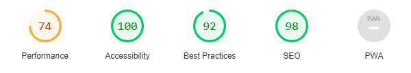

# 95Films
95Films is a site for a film studio that specializes in making visual content for both individuals and companies. Users of this website will be able to find information about the company and what the company offers. There is also a contact page where the user can book a meeting with the company. The site is targeted for both companies and individuals who are in need of visual media.

## Features

- **Navigation Bar**

  - The navigation bar is featured on all three pages and is fully responsive. 
  - The black font of the menu items
contrasts to the white background, making it more accessible. 
  - The navigation bar also contains a logo that links to the homepage and links to each section of the website. 
  - An underscore appears underneath the active link, to show the user which page they are on. 

- **Header**

  - The header contains an image showcasing the kind of work that the company does. 
  - The header also contains a heading and paragraph that briefly informs the user about what services the company offers and the companies history.

- **Services**

  - This section contains two images showcasing moviesets that the company has worked on. 
  - The heading and paragraph between the images also informs the user what the company offers in more detail.

)

- **Footer**

  - The footer features a paragraph that informs the user of the company adress.
  - The footer section includes links to 95Films different social media sites. 
  - The links will open to a new tab to allow easy navigation for the user.
  - The footer is encourages the user to keep connected via social media. 

- **Gallery**

  - The gallery includes several images of the company working on films. This gives the company more credibility. 
  - The images portrays grand moviesets and expensive filmmaking equipment, which also provide value to the user by showcasing what kind of level the company operates on. 

- **The Contact Page**

  - This page will allow the user to reach out to the company to ask any questions or book a consultation. 
  - The page contains a responsive form which encourages the user to enter their first and last name, phonenumber and also leave a message. This feature is valuable to the user as it gives them the option to not only send a message/question to the company but also book a meeting with them.   
  - The heading and paragraph on the site provides the user with information on the company location and encourages the user to
contact the company or visit the office. As a user this is valuable information to know and informing the user about the office location provides further credibility to the company. 
  - Submitting the form correctly will redirect the user to a confirmation page with information on response time. This provides the user
with sense of security that their request/question has been submitted and when they can expect a response. 

## Features Left to Implement
I would like to add a responsive hamburger navigation bar, that only appears on medium to smaller screens. The navigation menu would
cover the page when clicked on and would be easily closed again. This feature would be preferable to the responsive navigation bar that is
currently on the site, as it would make it more accessible for the user. 

# Testing
- I have tested the site in Google Chrome, Internet Explorer and Mozilla Firefox.
- Using Chrome devtools device toolbar I have confirmed that the site is responsive on all standard screen sizes. 
- I have confirmed that the form work including a working confirmation page. The telephone field will only accept a phonenumber.
- I have confirmed that the sites content is readable and easy to understand. This includes the header, navigation menu, contact page and main page.

## Validator Testing

### HTML
No errors were returned when passing through the official W3C validator.
### CSS
No errors were found when passing through the official (Jigsaw) validator.

## Bugs

### Solved Bugs
- Elements would stack on top of the header and navigation menu. To solve this bug I wrapped the header inside a div and gave it a class. By 
then adding padding, background color and width I could push down the content below.
- The footer would stack in the middle of the contact page. To solve this I made a div and gave it padding and a different background colour as styling. 
This allowed me to push down the footer with the div. 

### Unsolved Bugs
The navigation bar switches positions slightly at different screen sizes. Media queries have not helped. 

# Deployment
- The site was deployed to Github Pages. The step to deploy as follows:
  - In the Github repository, navigate to the Settings tab.
  - From the Settings tab, navigate to the Pages tab on the side menu. 
  - From the source section drop-down menu, select the Main branch.
  - Once the master branch has been selected, the page provided the link to the finished website.
  
  The live link can be found [here](https://alexanderjsn.github.io/95Films/index.html)

# Credits

## Content

- The icons in the footer were taken from [Font Awesome](https://fontawesome.com/)
- Instructions on how to position form inputs were taken from [W3schools](https://www.w3schools.com/howto/howto_css_stacked_form.asp)
- The code to remove the horizontal scroll that appeared on smaller screens were taken from [Stack Overflow](https://stackoverflow.com/questions/17756649/disable-the-horizontal-scroll)
- Instructions on how to make the social media links and footer were taken from the [CI LoveRunning project](https://github.com/Code-Institute-Solutions/love-running-2.0-sourcecode/tree/main/08-responsive-elements/05-responsive-gallery)
- Instructions on how to make the navigation bar were taken from the [CI Love Running project](https://github.com/Code-Institute-Solutions/love-running-2.0-sourcecode/tree/main/08-responsive-elements/05-responsive-gallery)
- Instructions on how to make the gallery and homepage images were taken from the [CI Love Running project](https://github.com/Code-Institute-Solutions/love-running-2.0-sourcecode/tree/main/08-responsive-elements/05-responsive-gallery)

## Media
- The royalty free photos used on the home page are from https://stock.adobe.com/
- The royalty free images used for the gallery page were taken from https://stock.adobe.com/

## Typography
- The fonts were taken from [Google Fonts](https://fonts.google.com/)

