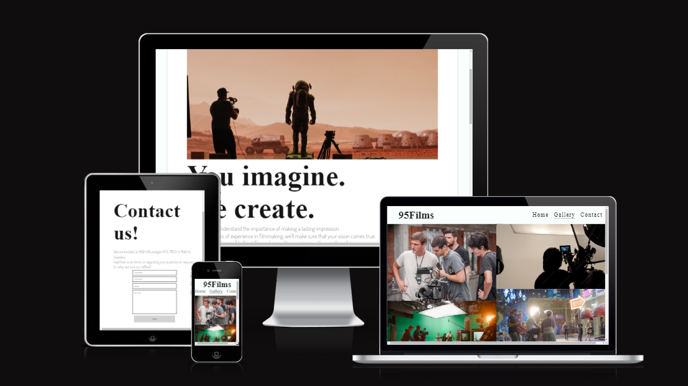
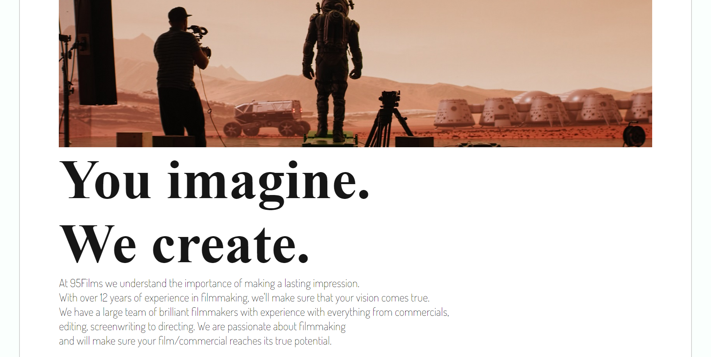
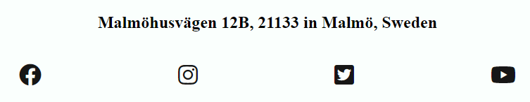
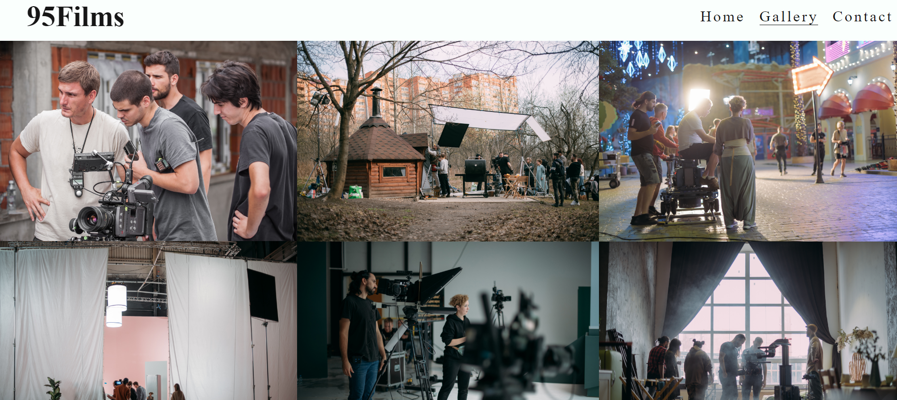
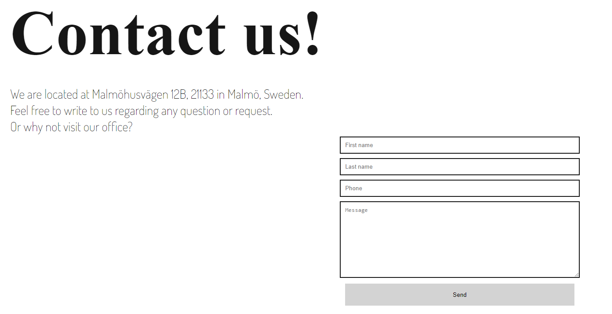
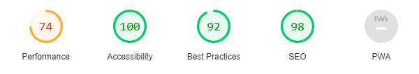

# 95Films
95Films is a site for a film studio that specializes in making visual content for both individuals and companies.
The site will be targeted for potential customers of the company. 

## Features

### Navigation Bar

The navigation bar is featured on all three pages and is fully responsive. The black font of the menu items
contrasts to the white background, making it more accessible. The navigation bar also contains a logo that links to the homepage and links to each section of the website. 
An underscore appears underneath the active link, to show the user which page they are on. 

## Main Section

The main section contains an image showcasing the kind of work that the company does. It also contains two big headings followed by paragraphs underneath that
tells the user what kind of services the company offers and a the company background.

## The Footer

The footer section includes links to the relevant social media sites for Love Running. The links will open to a new tab to allow easy navigation for the user.
The footer is valuable to the user as it encourages them to keep connected via social media. 

## Gallery

The gallery includes several images of the company working on films. This gives the company more credibility. 
The images potrays grand moviesets and expensive filmmaking equipment, which also provide value to the user by showcasing what kind of level the company operates on. 

## The Contact Page

This page will allow the user to reach out to the company to ask any questions or book a consultation.  
The page contains a responsive form which encoourages the user to enter their first and last name, phonenumber and also leave a message. 
The heading and paragraph on the site provides the user with information on the company location and encourages the user to
contact the company or visit the office. 

## Features Left to Implement
I would like to add a responsive hamburger navigation bar, that only appears on medium to smaller screens. The navigation menu would
cover the page when clicked on and would be easily closed again. This feature would be preferable to the responsive navigation bar that is
currently on the site, as it would provide the site with a more accessible approach. 

# Testing

## Validator Testing

### HTML
No errors were returned when passing through the official W3C validator
### CSS
No errors were found when passing through the official (Jigsaw) validator
### Unfixed Bugs

## Deployment
This section should describe the process you went through to deploy the project to a hosting platform (e.g. GitHub)

The site was deployed to GitHub pages. The steps to deploy are as follows:
In the GitHub repository, navigate to the Settings tab
From the source section drop-down menu, select the Master Branch
Once the master branch has been selected, the page will be automatically refreshed with a detailed ribbon display to indicate the successful deployment.
The live link can be found here - https://alexanderjsn.github.io/95Films/

# Credits

## Content

The fonts were taken from Google Fonts
The icons in the footer were taken from Font Awesome
Instructions on how to position form inputs was taken from https://www.w3schools.com/howto/howto_css_stacked_form.asp

## Media
The royalty free photos used on the home page are from https://stock.adobe.com/
The royalty free images used for the gallery page were taken from https://stock.adobe.com/

## Acknowledgements
